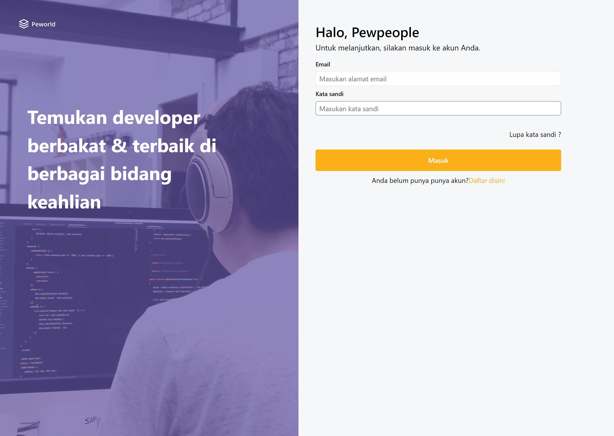
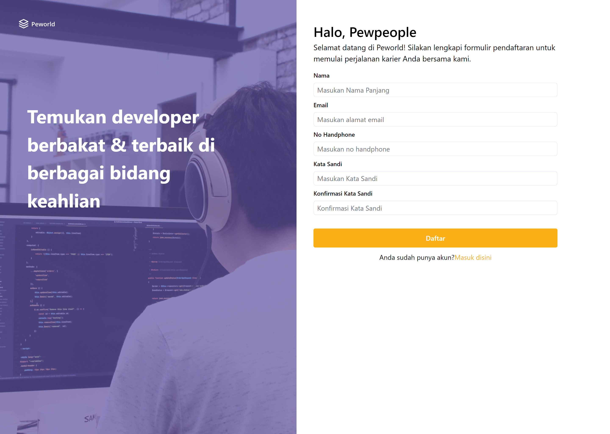
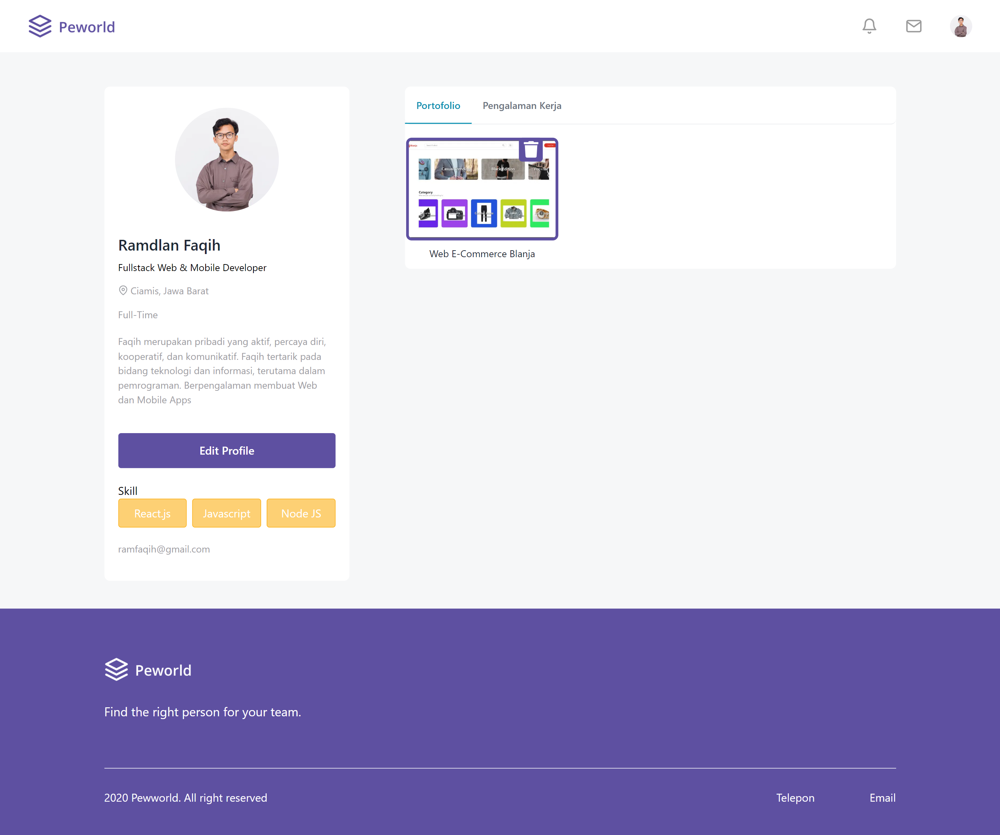

# Peworld Website Frontend Documentation

This Documentation provides a comprehensive guide to the frontend development of the Peworld website. Here, you will find detailed information about the project's structure, and usage guidlines. Please read through this document carefully to gain insight into the Peworld Frontend

## Table Of Content
- [Project Structure](#project-structure)
- [Description](#description)
- [Screenshots](#screenshots)
- [Built With](#built-with)
- [Usage](#usage)
- [Related Project](#related-project)
- [Contributing](#contributing)

## Description
Peworld is a HireJob website aimed at connection job seekers and recruiters. You can browse job listings from various industries and locations or create your own profile and showcase your portfolio and resume. Peworld can help you find your dreams. And if you are a recruiter, Peworld can help you find the right person for your team.

## Screenshots
<details>
  <summary>
    Login
  </summary>

</details>
<details>
  <summary>
    Register Workers
  </summary>

</details>
<details>
  <summary>
    Register Recruiters
  </summary>

</details>
<details>
  <summary>
    Landing Page
  </summary>

</details>
<details>
  <summary>
    Home Page
  </summary>

</details>
<details>
  <summary>
    Profile Workers
  </summary>

</details>
<details>
  <summary>
    Edit Profile Workers
  </summary>

</details>
<details>
  <summary>
    Profile Reccruiters
  </summary>

</details>
<details>
  <summary>
    Edit Profile Recruiters
  </summary>

</details>
<details>
  <summary>
    Hire Page
  </summary>

</details>
<details>
  <summary>
    Notifications
  </summary>

</details>
## Built With
- [Next.js](https://nextjs.org/)

## Package Dependencies
```json
  "dependencies": {
    "axios": "^1.6.0",
    "bcrypt": "^5.1.1",
    "cloudinary": "^1.41.0",
    "dotenv": "^16.3.1",
    "flowbite": "^1.8.1",
    "flowbite-react": "^0.6.4",
    "js-cookie": "^3.0.5",
    "jsonwebtoken": "^9.0.2",
    "next": "13.5.4",
    "pg": "^8.11.3",
    "react": "^18",
    "react-dom": "^18",
    "react-dropzone": "^14.2.3",
    "react-icons": "^4.11.0",
    "react-modal": "^3.16.1"
  },
```

## Usage

To run the Peworld website frontend locally, you'll need to have Node.js and npm (Node Package Manager) installed on your system. Follow these steps to install Next.js and other dependencies:

1. **Install Node.js and npm:**
   If you haven't already installed Node.js and npm, you can download and install them from the official [Node.js website](https://nodejs.org/).

Certainly! If you want users to fork the Peworld website frontend repository before following the installation steps, you can include the fork step in your documentation. Here's how you can update the "Usage" section to include forking the repository:

### Usage

#### Forking the Peworld Frontend Repository

1. **Fork the repository:**
   First, fork the Peworld website frontend repository by visiting the following GitHub URL:
   [https://github.com/RamdlanFaqih/peworld-next.git](https://github.com/RamdlanFaqih/peworld-next.git)

   Click on the "Fork" button in the top right corner of the GitHub page. This will create a copy of the repository in your GitHub account.

2. **Clone the forked repository:**
   Once you have forked the repository, clone it to your local machine using the following command (replace `<your-username>` with your GitHub username):

   ```
   git clone https://github.com/<your-username>/peworld-next.git
   ```

   This command will clone the forked repository to your local system.

3. **Navigate to the project directory:**
   Change your current directory to the cloned repository:

   ```
   cd peworld-next
   ```

4. **Install project dependencies:**
   Inside the `peworld-next` directory, install the project dependencies listed in the `package.json` file using npm:

   ```
   npm install
   ```

   This command will install all the necessary packages and libraries, including Next.js, specified in the `dependencies` section of your `package.json` file.

5. **Start the development server:**
   Once the installation is complete, you can start the Next.js development server with the following command:

   ```
   npm run dev
   ```

   This command will start the development server, and you can view your Peworld website frontend by visiting `http://localhost:3000` in your web browser.

Congrlatulations, you can set up the Peworld website frontend for development.

## Related Project


